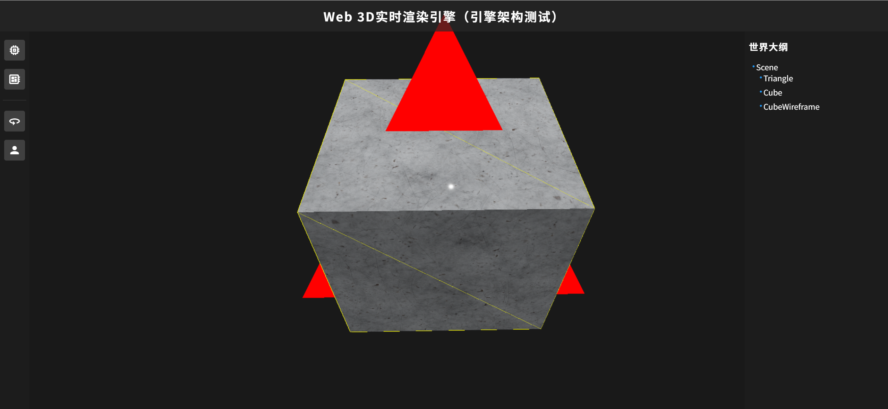

# iEngine

A lightweight real-time graphics rendering engine with a unified architecture across native and web platforms.

- **iEngine-Native**: Core implementation in **C++17**, targeting desktop with **OpenGL** or **Dawn** (WebGPU).  
  In the future, it will also be compiled to **WebAssembly** for web deployment.

- **iEngine-Web**: A **pure TypeScript prototype** that reimplements key parts of the engine architecture **directly in the browser** using **WebGL 1/2** or **browser-native WebGPU**.  
  This version does **not** use WebAssembly — it exists solely to rapidly validate and iterate on the engine’s design.

> **Note**: iEngine-Web is a **design testbed**, not a production renderer. The long-term vision is to run the **single C++ codebase** (iEngine-Native) on both desktop and web via WebAssembly:
>
> - iEngine-Native will be compiled to **WebAssembly** via Emscripten, automatically mapping:
>   - OpenGL → **WebGL 1/2**
>   - Dawn (WebGPU) → **browser-native WebGPU**

  
